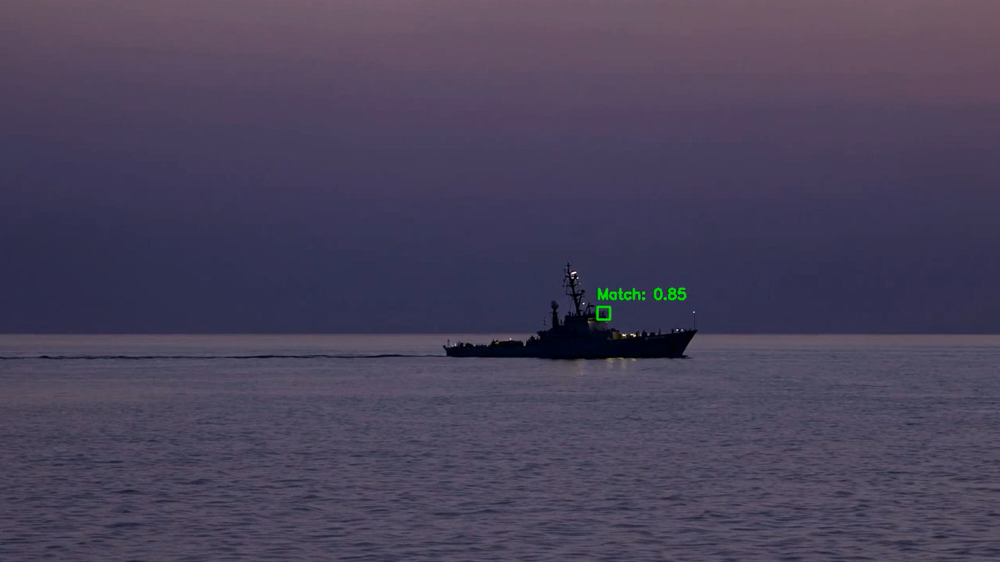

# Morse Code on Vessel Generation

A synthetic data generation pipeline that overlays realistic morse code light signals onto AI-generated vessel footage. The system uses **multi-scale template matching** to track vessels frame-by-frame and composites physically-inspired flash effects (inverse-square-law glow) onto the detected vessel position, producing labeled training data for maritime morse code signal recognition.

## Table of Contents

- [Overview](#overview)
- [Pipeline Architecture](#pipeline-architecture)
- [Data Acquisition](#data-acquisition)
- [Template Matching for Vessel Localization](#template-matching-for-vessel-localization)
- [Morse Code Engine](#morse-code-engine)
- [Flash Rendering](#flash-rendering)
- [Exposure Correction](#exposure-correction)
- [Output Dataset](#output-dataset)
- [Project Structure](#project-structure)
- [Dependencies](#dependencies)
- [Usage](#usage)
- [Experiments](#experiments)

## Overview

Collecting real-world maritime morse code signaling footage is expensive and rare. This project generates synthetic training videos by:

1. **Generating base vessel footage** using [OpenAI Sora](https://openai.com/sora) across day and night/evening lighting conditions
2. **Locating the vessel** in each frame via OpenCV multi-scale template matching
3. **Overlaying morse code flash effects** that follow the vessel as it moves, with physically-modeled light falloff
4. **Producing diverse labeled data** by randomizing morse messages, WPM speeds, flash colors, and lighting conditions

The generated dataset is suitable for training and evaluating models that detect and decode morse code light signals from maritime surveillance video.

## Pipeline Architecture

```
Sora-Generated Vessel Videos (.mp4)
        |
        v
Manual ROI Crop (screenshot) --> template.png (per video)
        |
        v
  For Each Video + Template:
  +-----------------------------------------+
  |  1. Load video & template               |
  |  2. Randomize parameters:               |
  |     - Message (SOS/PARIS/MAYDAY/...)    |
  |     - WPM speed (6/8/10)               |
  |     - Flash color (yellow/red)          |
  |     - Glow radius, strength, epsilon    |
  |  3. Initialize RepeatingMorseFlasher    |
  |  4. For each frame:                     |
  |     a. flasher.step() --> on/off state  |
  |     b. multiscale_match() --> (x,y,w,h) |
  |     c. Exposure correction (day/night)  |
  |     d. Position smoothing (hysteresis)  |
  |     e. If flash_on: render glow effect  |
  |     f. Write frame to output video      |
  |  5. Log morse timing via MarkerLogger   |
  +-----------------------------------------+
        |
        v
  Processed Videos + Morse Logs
```

## Data Acquisition

### Raw Video Generation with Sora

The base vessel footage is generated using **OpenAI Sora**, producing ~20-second clips of ships in various maritime settings. The videos cover two broad lighting conditions:

- **Day** scenes (`6_day`, `7_day`, `8_day`, `9_day`, `11_day`, `12_day`)
- **Evening/Night** scenes (`1_evening`, `2_evening`, `3_evening`, `4_evening`, `5_evening`, `10_evening`)

Each video features a vessel traversing the frame (left-to-right or right-to-left) against an ocean backdrop.

### Manual ROI Cropping for Template Matching

For each raw video, a **template image** (`template.png`) is created by manually screenshotting and cropping the vessel's Region of Interest (ROI) from a representative frame. This cropped template serves as the reference for OpenCV's template matching to locate the vessel in every subsequent frame.



> **Note:** The `raw_data/` and `processed_videos/` directories are excluded via `.gitignore` since they contain large video files. The raw videos must be regenerated with Sora, and templates must be manually re-cropped from representative frames.

## Template Matching for Vessel Localization

The system uses **multi-scale normalized cross-correlation** (`cv2.TM_CCOEFF_NORMED`) to robustly locate the vessel across frames, handling scale variations due to vessel movement.

### `multiscale_match(frame, template, scales)`

```
For each scale factor s in [0.5 ... 1.0]:
  1. Resize template to (tw*s, th*s)
  2. Run cv2.matchTemplate (normalized cross-correlation)
  3. Track best match score and location across all scales
Return: (x, y, w, h, confidence) or None
```

### Position Smoothing (Hysteresis)

To prevent flash position from jumping due to noisy matches, a **hysteresis filter** rejects position updates that exceed a 10-pixel threshold:

```python
if abs(x - x_previous) <= 10 and abs(y - y_previous) <= 10:
    x_previous, y_previous = x, y   # accept new position
else:
    x, y = x_previous, y_previous   # reject outlier, keep previous
```

This keeps the flash locked to the vessel even when template matching temporarily produces a spurious result.

## Morse Code Engine

### Timing Model

The morse code timing follows the **International Morse Code** standard:

| Element | Duration (units) |
|---------|-----------------|
| Dot (`.`) | 1 |
| Dash (`-`) | 3 |
| Intra-character gap | 1 |
| Inter-letter gap | 3 |
| Inter-word gap | 7 |
| Repeat pause | 7 |

One unit = `1.2 / WPM` seconds (standard PARIS calibration).

### `RepeatingMorseFlasher` (State Machine)

A frame-by-frame state machine that drives the flash on/off pattern:

```
step() called once per video frame:
  - Returns (flash_on: bool, completed_cycle: bool, kind: str)
  - Manages: initial delay --> morse segments --> repeat pause --> loop
  - Supports optional timing jitter (noise parameter) for realism
```

### `MarkerLogger` (Timing Verifier)

Records every state transition with millisecond precision and decodes the morse back to text, enabling verification that the visual output matches the intended message.

### Supported Messages

| Message | WPM | Use Case |
|---------|-----|----------|
| `SOS` | 6 | Distress signal |
| `PARIS` | 8 | Standard calibration word |
| `MAYDAY` | 8 | Emergency call |
| `ONE FATHOM BANK` | 10 | Navigation reference |

## Flash Rendering

Two rendering modes handle the different lighting conditions:

### Night/Evening: Additive Color Glow

`add_flashlight_inv_r2_blur_color()` - Adds a colored glow using **additive blending**:

```
glow(r) = 1/(r^2 + epsilon) - 1/(R^2 + epsilon)    (inverse-square law)
output  = frame + glow * color * strength            (additive)
```

- Models realistic light intensity falloff (1/r^2 physics)
- Gaussian blur softens the glow edges
- Colors: bright yellow `(100,255,255)` or red `(0,0,255)` in BGR
- Typical parameters: radius 20-35px, strength 0.7-0.9

### Day: Alpha-Composited Glow

`add_flashlight_inv_r2_blur_alpha()` - Uses **alpha compositing** for bright scenes:

```
alpha(r) = glow(r) * strength * alpha_max
output   = (1 - alpha) * frame + alpha * color       (alpha blend)
```

- Prevents washed-out appearance that additive blending causes in bright scenes
- `alpha_max=0.9` ensures the background always shows through slightly
- Typical parameters: radius 7-8px, strength 1.0-1.2

## Exposure Correction

### Night: Exponential Dimming

`dim_frame_exponential(k=8, min_factor=0.01)` - Darkens frames to simulate nighttime:

```
factor = max(min_factor, exp(-k * mean_luminance))
output = frame * factor
```

With `k=8` and `min_factor=0.01`, evening footage is dramatically darkened to make the flash glow prominent.

### Day: Auto-Gain Exposure

`auto_gain_exposure(target=0.9, k=2.3)` - Brightens day scenes for consistent exposure:

```
gain = clip(exp(k * (target - mean_luminance)), min_gain, max_gain)
output = frame * gain
```

## Output Dataset

### Filename Convention

```
{index}_{time}_{message}_{wpm}wpm_{color}_nonoise.mp4
```

Examples:
- `0_night_SOS_6wpm_bright_yellow_nonoise.mp4`
- `5_day_PARIS_8wpm_red_nonoise.mp4`
- `3_night_ONE FATHOM BANK_10wpm_bright_yellow_nonoise.mp4`

### Metadata Encoded in Filenames

| Field | Values |
|-------|--------|
| Index | 0-11 (maps to source video) |
| Time | `day` or `night` |
| Message | SOS, PARIS, MAYDAY, ONE FATHOM BANK |
| WPM | 6, 8, 10 |
| Color | bright yellow, red |

### Morse Timing Logs

Each processed video can produce a `morse_log.txt` containing decoded timing data:

```
('on', 200.0, 'dot'), ('off', 200.0, 'intra'), ('on', 200.0, 'dot'), ... -> 'S'
('on', 600.0, 'dash'), ('off', 200.0, 'intra'), ('on', 600.0, 'dash'), ... -> 'O'
('on', 200.0, 'dot'), ('off', 200.0, 'intra'), ('on', 200.0, 'dot'), ... -> 'S'
```

## Project Structure

```
morse-code-on-vessel-generation/
|
+-- deployment_codes/
|   +-- morse_generation.ipynb      # Main production pipeline
|   +-- raw_data/                   # (gitignored) Production input videos + templates
|       +-- 1_evening/
|       |   +-- 1.mp4              # Sora-generated vessel video
|       |   +-- template.png       # Manually cropped vessel ROI
|       +-- ...
|
+-- experiments/
|   +-- paste_morse_flash.ipynb     # Template matching & flash rendering experiments
|   +-- morse_generation.ipynb      # Experimental morse generation (night focus)
|   +-- combine_videos.ipynb        # Video concatenation utility
|   +-- vessel_tracking.ipynb       # SAM2 segmentation experiments
|
+-- raw_data/                       # (gitignored) Raw Sora videos + templates
|   +-- {N}_{time}_{duration}/
|       +-- {N}.mp4
|       +-- template.png
|
+-- processed_videos/               # (gitignored) Generated output videos
|   +-- video_unordered/
|       +-- {message}_{wpm}wpm_{time}_{direction}_{noise}_{color}.mp4
|
+-- paste_morse_flash.png           # Screenshot demonstrating template matching
+-- .gitignore
+-- README.md
```

## Dependencies

| Library | Version | Purpose |
|---------|---------|---------|
| `opencv-python` (`cv2`) | 4.x+ | Video I/O, template matching, image processing |
| `numpy` | 1.x+ | Array operations, coordinate grids, random number generation |
| `glob` | stdlib | File pattern matching |

### Optional (Experiments Only)

| Library | Purpose |
|---------|---------|
| `torch` | GPU/CPU device selection for SAM2 |
| `matplotlib` | Visualization of segmentation masks |
| `sam2` | Meta's Segment Anything Model v2 for vessel segmentation |

## Usage

### 1. Prepare Raw Data

Generate vessel footage using Sora and organize into the `raw_data/` folder:

```
raw_data/
  1_evening/
    1.mp4           # Sora-generated video
    template.png    # Manually cropped vessel ROI from a frame
  2_evening/
    2.mp4
    template.png
  ...
```

For each video, take a screenshot of a frame and crop just the vessel to create `template.png`.

### 2. Run the Pipeline

Open and run `deployment_codes/morse_generation.ipynb`. The notebook will:

1. Discover all videos matching the `raw_data/{N}_{time}/{N}.mp4` pattern
2. For each video, randomly select a morse message, WPM, and flash color
3. Process every frame: detect vessel, apply exposure correction, overlay flash
4. Write output videos to the `processed_videos/` directory

### 3. Verify Output

The `MarkerLogger` decodes the morse timing back to text. Check the printed output to verify the message was correctly encoded:

```
('on', 200.0, 'dot'), ('off', 200.0, 'intra'), ... -> 'S'
('on', 600.0, 'dash'), ('off', 200.0, 'intra'), ... -> 'O'
('on', 200.0, 'dot'), ('off', 200.0, 'intra'), ... -> 'S'
```

## Experiments

The `experiments/` folder contains development notebooks used to iterate on the pipeline:

| Notebook | Purpose |
|----------|---------|
| `paste_morse_flash.ipynb` | Core development notebook - template matching, flash rendering, and morse encoding. Tests the full pipeline on individual videos with configurable parameters. |
| `morse_generation.ipynb` | Batch processing variant with different parameter ranges. Used for generating larger dataset batches. |
| `combine_videos.ipynb` | Utility for concatenating multiple short Sora clips into longer sequences. |
| `vessel_tracking.ipynb` | Experimental SAM2 (Segment Anything Model v2) integration for semantic vessel segmentation as an alternative to template matching. Uses box prompts and mask-based matching (`cv2.TM_CCORR_NORMED` with mask). |
